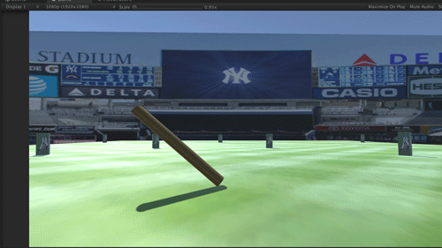

# Project 1: Donovan Valle

This is a simple picth-and-bat baseball game. The idea is to use your timing and hand eye coordination to pitch the baseball and hit it for a home run.

Instructions: Press A to pitch the baseball. Press and hold the SPACE bar in a quick fashion to swing the baseball. 

